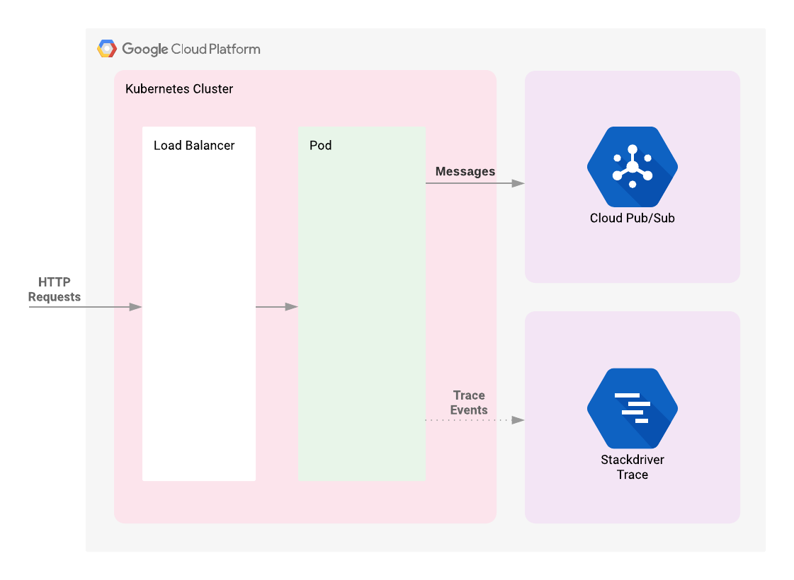
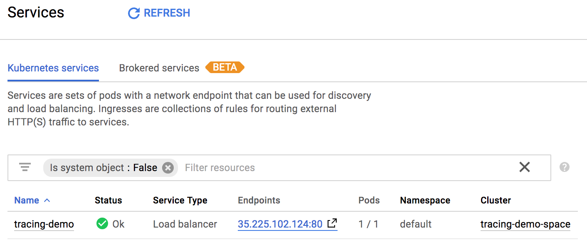
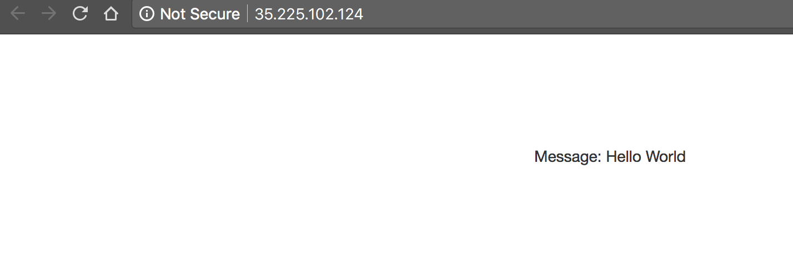
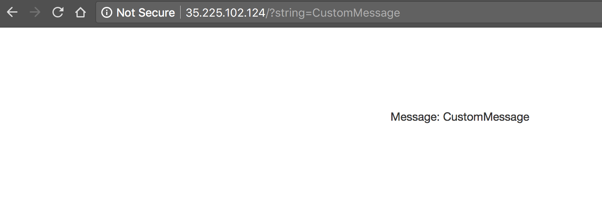
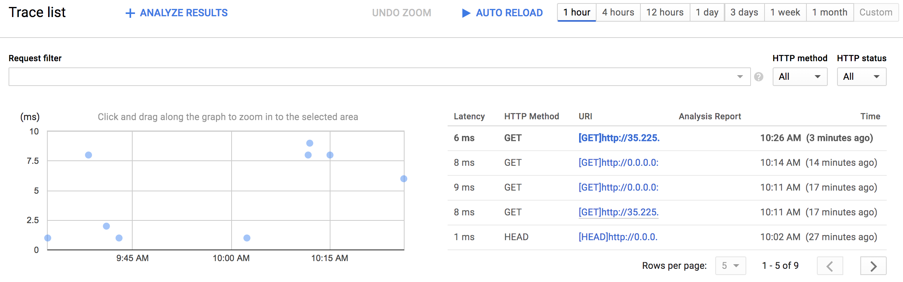
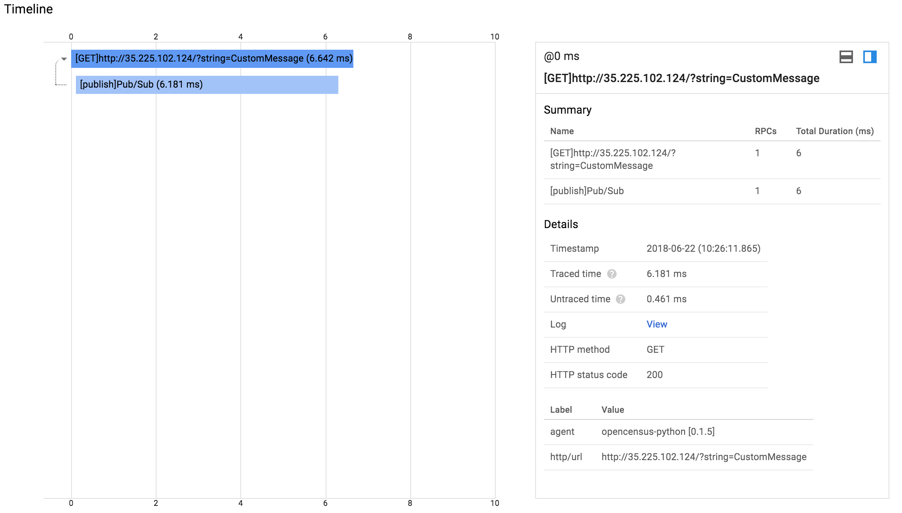
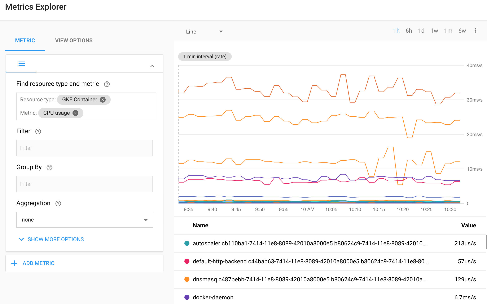
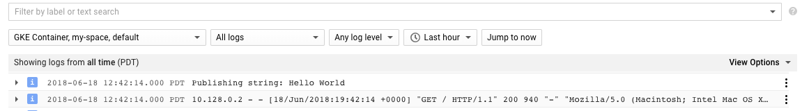

# Tracing with Stackdriver on Kubernetes Engine 
<!-- omit in toc -->

  * [Tracing with Stackdriver on Kubernetes Engine ](#tracing-with-stackdriver-on-kubernetes-engine-)
  * [Introduction](#introduction)
  * [Architecture](#architecture)
  * [Initialize gcloud](#initialize-gcloud)
     * [Enable GCP APIs](#enable-gcp-apis)
  * [Deployment](#deployment)
     * [Introduction to Terraform](#introduction-to-terraform)
     * [Running Terraform](#running-terraform)
        * [Initialization](#initialization)
        * [Deployment](#deployment-1)
  * [Validation](#validation)
     * [Generating Telemetry Data](#generating-telemetry-data)
     * [Examining Traces](#examining-traces)
     * [Pulling Pub/Sub Messages](#pulling-pubsub-messages)
     * [Monitoring and Logging](#monitoring-and-logging)
  * [Teardown](#teardown)
  * [Troubleshooting](#troubleshooting)
  * [Relevant Materials](#relevant-materials)
     * [Kubernetes](#kubernetes)
     * [OpenCensus](#opencensus)
     * [Spring Sleuth](#spring-sleuth)
     * [Stackdriver](#stackdriver)
     * [Terraform](#terraform)
     * [Zipkin](#zipkin)

<!-- omit in toc -->

## Introduction

When supporting a production system that services HTTP requests or provides an
API, it is important to measure the latency of your endpoints to detect when a
system's performance is not operating within specification. In monolithic
systems this single latency measure may be useful to detect and diagnose
deteriorating behavior. With modern microservice architectures, however, this
becomes much more difficult because a single request may result in numerous
additional requests to other systems before the request can be fully handled.
Deteriorating performance in an underlying system may impact all other systems
that rely on it. While latency can be measured at each service endpoint it can
be difficult to correlate slow behavior in the public endpoint with a
particular sub-service that is misbehaving.

Enter distributed tracing. Distributed tracing uses metadata passed along with
requests to correlate requests across service tiers. By collecting telemetry
data from all the services in a microservice architecture and propagating a
_trace id_ from an initial request to all subsidiary requests, developers can
much more easily identify which service is causing slowdowns affecting the rest
of the system.

[Google Cloud Platform (GCP)](https://cloud.google.com/) provides the
[Stackdriver](https://cloud.google.com/stackdriver/) suite of products to
handle logging, monitoring, and distributed tracing. This document will discuss
the latter feature and provide a distributed tracing demo that can service as a
basis for your own applications. The demo will be deployed to
[Kubernetes Engine](https://cloud.google.com/kubernetes-engine/) and will
demonstrate a multi-tier architecture implementing distributed tracing. It will
also take advantage of [Terraform](#terraform) to build out necessary
infrastructure.

This demo requires an active GCP account. You can sign up for a
[free account](https://cloud.google.com/) if you don't already have one. It
will come with free credits for beginning your GCP experience.

This demo is designed for MacOS and Linux systems but users can alternatively
use the [Google Cloud Shell](https://cloud.google.com/shell/docs/) entirely in
the cloud without requiring a local system.

## Architecture

This demonstration application will begin by deploying a Kubernetes Engine
cluster. To this cluster will be deployed a simple web application fronted by a
load balancer. The web app will publish messages provided by the user to a
[Cloud Pub/Sub](https://cloud.google.com/pubsub/docs/overview) topic. The
application is instrumented such that HTTP requests to it will result in the
creation of a trace whose context will be propagated to the Cloud Pub/Sub
publish API request. The correlated telemetry data from these requests will be
available in the Stackdriver Trace Console.



## Initialize gcloud

When using Cloud Shell execute the following command in order to setup gcloud cli. When executing this command please setup your region and zone.

```console
gcloud init
```

### Enable GCP APIs

The following APIs need to be enabled:
* Kubernetes Engine API
* Stackdriver Trace API

The following commands will enable these APIs:

```console
gcloud services enable container.googleapis.com
gcloud services enable cloudtrace.googleapis.com
```

## Deployment

### Introduction to Terraform

Following the principles of
[infrastructure as code](https://en.wikipedia.org/wiki/Infrastructure_as_Code)
and
[immutable infrastructure](https://www.oreilly.com/ideas/an-introduction-to-immutable-infrastructure),
Terraform supports the writing of declarative descriptions of the desired state
of infrastructure. When the descriptor is applied, Terraform uses GCP APIs to
provision and update resources to match. Terraform compares the desired state
with the current state so incremental changes can be made without deleting
everything and starting over.  For instance, Terraform can build out GCP
projects and compute instances, etc., even set up a Kubernetes Engine cluster
and deploy applications to it. When requirements change, the descriptor can be
updated and Terraform will adjust the cloud infrastructure accordingly.

This example will start up a Kubernetes Engine cluster using Terraform. Then
you will use Kubernetes commands to deploy a demo application to the cluster.
By default, Kubernetes Engine clusters in GCP are launched with a
pre-configured [Fluentd](https://www.fluentd.org/)-based collector that
forwards logging events for the cluster to Stackdriver. Interacting with the
demo app will produce trace events that are visible in the
[Stackdriver Trace UI](https://console.cloud.google.com/traces).

### Running Terraform

There are three Terraform files provided with this example, located in the `/terraform` subdirectory of the project. The first one, `main.tf`, is the starting point for Terraform. It describes the features that will be used, the resources that will be manipulated, and the outputs that will result. The second file is `provider.tf`, which indicates which cloud provider and version will be the target of the Terraform commands--in this case GCP. The final file is `variables.tf`, which contains a list of variables that are used as inputs into Terraform. Any variables referenced in the `main.tf` that do not have defaults configured in `variables.tf` will result in prompts to the user at runtime.

#### Initialization
Given that authentication was [configured](#configure-authentication) above, we
are now ready to deploy the infrastructure. Run the following command from the root directory of the project:

```console
cd terraform
```

Once there, Terraform needs to be initialized. This will download the dependencies that Terraform requires to function. Enter:
```console
terraform init
```

For this demo, Terraform needs two pieces of information in order to run: the GCP _project_ and the GCP _zone_ to which the demo application should be deployed. Terraform will prompt for these values if it does not know them already. By default, it will look for a file called `terraform.tfvars` or files with a suffix of `.auto.tfvars` in the current directory to obtain those values. This demo provides a convenience script to prompt for project and zone and persist them in a `terraform.tfvars` file. Run:

```console
../scripts/generate-tfvars.sh
```

If the file already exists you will receive an error.

The script uses previously-configured values from the `gcloud` command. If they have not been configured, the error message will indicate how they should be set. The existing values can be viewed with the following command:

```console
gcloud config list
```

If the displayed values don't correspond to where you intend to run the demo application, change the values in `terraform.tfvars` to your preferred values.

#### Deployment

Having initialized Terraform you can see the work that Terraform will perform with the following command:

```console
terraform plan
```

This command can be used to visually verify that settings are correct and Terraform will inform you if it detects any errors. While not necessary, it is a good practice to run it every time prior to changing infrastructure using Terraform.

After verification, tell Terraform to set up the necessary infrastructure:

```console
terraform apply
```

It display the changes that will be made and asks you to confirm with `yes`.

After a few minutes you should find your [Kubernetes Cluster](https://console.cloud.google.com/kubernetes) and [Pub/Sub Topic and Subscription](https://console.cloud.google.com/cloudpubsub) in the GCP console.

Now, deploy the demo application using Kubernetes's `kubectl` command:

```console
kubectl apply -f tracing-demo-deployment.yaml
```

Once the app has been deployed, it can be viewed in the [Workload](https://console.cloud.google.com/kubernetes/workload) tab of the Kubernetes Engine Console. You can also see the load balancer that was created for the application in the [Services](https://console.cloud.google.com/kubernetes/discovery) section of the console.

Incidentally, the endpoint can be programmatically acquired using the following command:

```console
echo http://$(kubectl get svc tracing-demo -n default \
  -ojsonpath='{.status.loadBalancer.ingress[0].ip}')
```

## Validation

### Generating Telemetry Data

Once the demo application is deployed, go to
https://console.cloud.google.com/kubernetes/discovery and if it isn't already
selected select the project used for this demo with the combobox in the
upper-left corner. You should see a list of your exposed services:



Clicking on the endpoint listed next to the `tracing-demo` load balancer will
open the demo app web page in a new tab of your browser. Note that your IP
address will likely be different from the example above. The page displayed is
simple:



To the url, add the string: `?string=CustomMessage` and see that the message is
displayed:



As you can see, if a `string` parameter is not provided it uses a default value
of `Hello World`. The app itself isn't very interesting. We are simply using it
to generate trace telemetry data.

### Examining Traces

Navigate to https://console.cloud.google.com/traces/traces and select your
project from the combobox in the upper left-hand corner of your screen if it is
not already selected. You should see a chart displaying trace events plotted on
a timeline with latency as the vertical metric.



Click on one of the dots on the chart. You will see a chart with two bars, the
top one longer than the bottom one:



The top bar is known as the _root span_ and represents the duration of the HTTP
request, from the moment the first byte arrives until the moment the last byte
of the response is sent. The bottom bar represents the duration of the request
made when sending the message to the Pub/Sub topic.

Since the handling of the HTTP request is blocked by the call to the Pub/Sub
API it is clear that the vast majority of the time spent within the HTTP
request is taken up by the Pub/Sub interaction. This demonstrates that by
instrumenting each tier of your application you can easily identify where the
bottlenecks are.

### Pulling Pub/Sub Messages

As described in the [Architecture](#architecture) section of this document,
messages from the demo app are published to a Pub/Sub topic. These messages can
be consumed from the topic using the `gcloud` CLI:

```console
gcloud pubsub subscriptions pull --auto-ack --limit 10 tracing-demo-cli
┌─────────────┬─────────────────┬────────────┐
│     DATA    │    MESSAGE_ID   │ ATTRIBUTES │
├─────────────┼─────────────────┼────────────┤
│ Hello World │ 121487601177521 │            │
└─────────────┴─────────────────┴────────────┘
```

Pulling the messages from the topic has no impact on tracing. This section
simply provides a consumer of the messages for verification purposes.

### Monitoring and Logging

Stackdriver monitoring and logging are not the subject of this demo, but it is
worth noting that the application you deployed will publish logs to
[Stackdriver Logging](https://console.cloud.google.com/logs/viewer) and
metrics to [Stackdriver Monitoring](https://app.google.stackdriver.com/)

For instance, see https://app.google.stackdriver.com/metrics-explorer and
select the `GKE Container` Resource Type and the `CPU usage` metric. You should
see a chart of this metric plotted for different pods running in the cluster:



As well, logs can be seen at https://console.cloud.google.com/logs/viewer:



You may need to click the `Load older logs` button to display published logs.

## Teardown

When you are finished with this example you will want to clean up the resources
that were created so that you avoid accruing charges:

```console
terraform destroy
```

As with `apply`, Terraform will prompt for a `yes` to confirm your intent.

Since Terraform tracks the resources it created it is able to tear down the
cluster, the Pub/Sub topic, and the Pub/Sub subscription.

## Troubleshooting

1. You may run into an issue where an API has not been enabled for your
   project. If you receive such an error the necessary API name may be listed. You
   can enable it with:

   ```console
   gcloud services list <service-name>
   ```

   where `<service-name>` is the identified service name. If the disabled API is
   not provided you can see a list of those available with the following command:

   ```console
   gcloud services list --available
   ```

   Identify the necessary service and enable it with the above command. Keep in
mind the
[principle of least privilege](https://en.wikipedia.org/wiki/Principle_of_least_privilege)
and limit access to those strictly necessary to run your applications.
2. A number of possible errors can be diagnosed using the `kubectl` command.
   For instance, a deployment can be shown:
   ```console
   kubectl get deployment tracing-demo
   NAME           DESIRED   CURRENT   UP-TO-DATE   AVAILABLE   AGE
   tracing-demo   1         1         1            1           2h
   ```

   More details can be shown with `describe`:

   ```console
   kubectl describe deployment tracing-demo
   ...
   ```

   This command will show a list of deployed pods:

   ```console
   kubectl get pod
   NAME                            READY     STATUS    RESTARTS   AGE
   tracing-demo-59cc7988fc-h5w27   1/1       Running   0          2h
   ```
   Again, details of the pod can be seen with `describe`:
   ```console
   kubectl describe pod tracing-demo
   ...
   ```

   Once the pod name is known logs can be viewed locally:

   ```console
   kubectl logs tracing-demo-59cc7988fc-h5w27
   10.60.0.1 - - [22/Jun/2018:19:42:23 +0000] "HEAD / HTTP/1.0" 200 - "-" "-"
   Publishing string: Hello World
   10.60.0.1 - - [22/Jun/2018:19:42:23 +0000] "GET / HTTP/1.1" 200 669 "-" "Mozilla/5.0 (Windows NT 10.0; WOW64) AppleWebKit/537.36 (KHTML, like Gecko) Chrome/51.0.2704.103 Safari/537.36"
   ```
3. The install script fails with a `Permission denied` when running Terraform.
   The credentials that Terraform is using do not provide the necessary
   permissions to create resources in the selected projects. Ensure that the
   account listed in `gcloud config list` has necessary permissions to create
   resources. If it does, regenerate the application default credentials using
   `gcloud auth application-default login`.

## Relevant Materials

The following are some relevant materials for further investigation:

### Kubernetes
[Kubernetes](https://kubernetes.io/) is a container orchestration platform
popular in microservice architectures. GCP provides a managed version of
Kubernetes called [Kubernetes Engine](https://cloud.google.com/kubernetes-engine/).

### OpenCensus
[OpenCensus](https://opencensus.io/) provides standardized libraries for
capturing and publishing trace telemetry data. Libraries are provided for a
number of popular languages and numerous trace platforms are supported,
including [Stackdriver](#stackdriver) and [Zipkin](#zipkin). The demo this
document describes uses OpenCensus to publish telemetry data to Stackdriver.

### Spring Sleuth
[Spring Sleuth](https://cloud.spring.io/spring-cloud-sleuth/) provides
instrumentation of Java applications that use the popular
[Spring](https://spring.io/) framework. Spring Sleuth supports an abstraction
over distributed trace telemetry collectors so developers can seamlessly switch
between [Zipkin](#zipkin), [Stackdriver](#stackdriver), and other trace engines.

### Stackdriver
[Stackdriver](https://cloud.google.com/stackdriver/) is a suite of tools in GCP
providing logging, monitoring, tracing, and related features. This document and
demo are particularly concerned with the
[Stackdriver Trace](https://cloud.google.com/trace/) feature it provides.

### Terraform
[Terraform](https://www.terraform.io/) is a declarative
[infrastructure as code](https://en.wikipedia.org/wiki/Infrastructure_as_Code)
tool that enables configuration files to be used to automate the deployment and
evolution of infrastructure in the cloud.

### Zipkin
[Zipkin](https://zipkin.io/) is a distributed tracing tool that helped
popularize the practice. Many frameworks provide Zipkin
[integration](https://zipkin.io/pages/existing_instrumentations.html) and those
that don't can [implement their own](https://zipkin.io/pages/instrumenting).

Applications that are already instrumented for Zipkin can have their Zipkin
telemetry data adapted to Stackdriver events through the use of a
[Zipkin Collector](https://cloud.google.com/trace/docs/zipkin). It can be
deployed to Kubernetes Engine:

```console
kubectl run stackdriver-zipkin   --image=gcr.io/stackdriver-trace-docker/zipkin-collector   --expose --port=9411
```

This will deploy the collector to the well known Zipkin port `9411` and
applications looking for it on their local port will find it indistinguishable
from a Zipkin server but telemetry data will appear in Stackdriver Trace.


**This is not an officially supported Google product**
